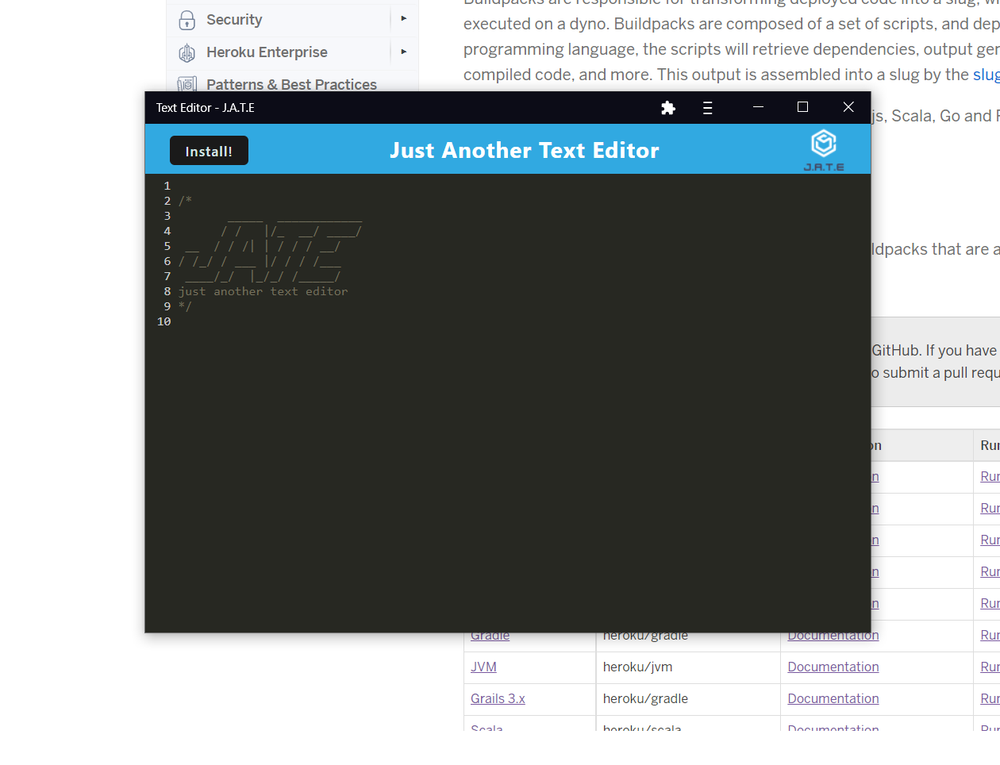

## <Text-Editor-Challenge>

## Author

James Van Osdol

## Description

This progressive web application project allows users to write text inside of a downloadable text editor. The text editor can be downloaded, by downloading the text editor, it gives the user the ability to use the text editor in offline mode.

This project takes advantage of the 'indexedDB' local storage in order to store the saved text in the text editor.

## Table of Contents

- [Installation](#installation)
- [Screenshots](#screenshots)
- [Credits](#credits)
- [How To Contribute](#how-to-contribute)
- [Contact](#contact)

## Built With

-Javascript
-HTML
-CSS
-Node.js
-SQL
-Inquirer

## Installation

Clone the repo
git clone https://github.com/jvanosdol/text-editor-challenge

## Screenshots

- Employee Tracker Screenshot

  
  
  

## Credits

- [Google](https://www.google.com)
- [W3](https://www.w3schools.com)
- [stackoverflow](https://stackoverflow.com/)

## Github Repo

https://github.com/jvanosdol/text-editor-challenge

## Deployed Link

https://text-editor-jvanosdol.herokuapp.com/

## How to Contribute

1. Fork the Project
2. Create your Feature Branch (git checkout -b)
3. Commit your Changes (git commit -m '')
4. Push to the Branch (git push origin)
5. Open a Pull Request

## Contact

Github username: jvanosdol

email: j.vanosdol99@yahoo.com
